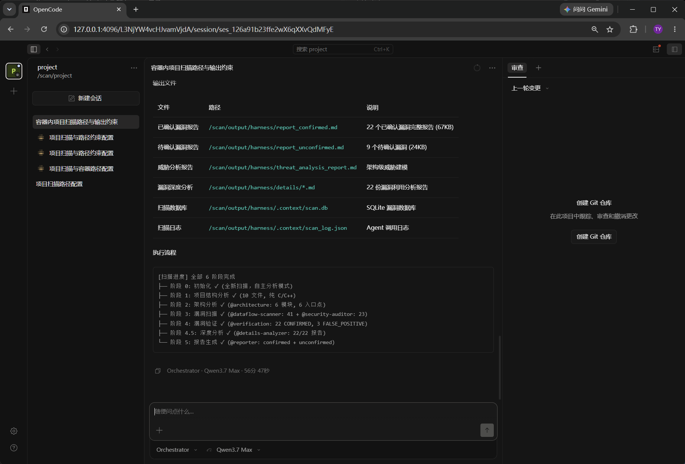

# OpenCode Security Scan Runner

基于 Docker Compose 的 OpenCode 代码安全扫描 Runner。用户配置一个任务 env 文件，指定待扫描项目、harness、模型密钥和输出目录，然后启动容器即可扫描。

运行环境：Linux 机器，已安装 Docker Engine 和 Docker Compose plugin。当前 Runner 基础镜像使用 Ubuntu 系的 `smanx/opencode:latest`。

## 目录

```text
.
├── docker-compose.yml
├── Dockerfile
├── jobs/                  # 任务配置模板与本机任务 env
├── opencode-config/       # 内置 harness
│   ├── crop/
│   └── multi_langage/
├── output/                # 示例扫描结果，可直接查看
├── runner/
└── sample-vulnerable-app/ # 示例待扫描项目
```

`jobs/*.env` 是本机任务配置，可能包含 API key，已被 Git 忽略。仓库只应提交 `jobs/*.env.example`。

## 快速开始

创建任务配置：

```bash
cp jobs/job-crop.env.example jobs/job-crop.env
```

编辑 `jobs/job-crop.env`：

```bash
vim jobs/job-crop.env
```

配置内容示例：

```env
DASHSCOPE_API_KEY=replace-with-your-dashscope-api-key
OPENCODE_MODEL=alibaba-cn/qwen3.7-max

SCAN_PROJECT_DIR=./sample-vulnerable-app
HARNESS_CONFIG_DIR=./opencode-config/crop
SCAN_OUTPUT_DIR=./output/crop
OPENCODE_HOST_PORT=4096
```

启动扫描：

```bash
docker compose --env-file jobs/job-crop.env --project-name scan-crop up --build -d
```

查看日志：

```bash
docker compose --env-file jobs/job-crop.env --project-name scan-crop logs -f opencode-scan
```

停止服务：

```bash
docker compose --env-file jobs/job-crop.env --project-name scan-crop down
```

## 使用 multi_langage Harness

```bash
cp jobs/job-multi_langage.env.example jobs/job-multi_langage.env
vim jobs/job-multi_langage.env
docker compose --env-file jobs/job-multi_langage.env --project-name scan-multi up --build -d
```

如需并行运行多个任务，请保证每个任务使用不同的：

- `--project-name`
- `SCAN_OUTPUT_DIR`
- `OPENCODE_HOST_PORT`

## 接入自己的 Harness

新增一套 harness 时，通常只需要改三类内容：harness 配置目录、任务 env、必要时的 Runner 或镜像配置。

1. 新增 harness 目录。

   在 `opencode-config/` 下新建一个目录，例如：

   ```text
   opencode-config/my-harness/
   ```

2. 放入 `.opencode` 内容。

   把 harness 工程的 `.opencode/` 目录内容直接放到 `opencode-config/my-harness/` 下，不要再多套一层 `.opencode/`。

   ```text
   opencode-config/my-harness/
   ├── opencode.jsonc
   ├── agents/
   ├── skills/
   └── tools/
   ```

3. 检查 `opencode.jsonc`。

   至少确认以下内容：

   - provider 可用，例如 Alibaba DashScope OpenAI-compatible provider。
   - model 和任务 env 中的 `OPENCODE_MODEL` 能对应上。
   - 如果 harness 工具需要访问挂载目录外的路径，确认权限配置符合预期。
   - 如果 harness 有自定义 tools，确认 `package.json`、`tools/` 等文件一起放进来了。

   Runner 会把 `HARNESS_CONFIG_DIR` 只读挂载到容器内 `/scan/opencode`，启动时再复制到容器内部可写的 OpenCode runtime config 目录。这样宿主机 harness 保持只读，同时 custom tools 可以从 runtime config 旁边解析 OpenCode 内置依赖。

4. 新增任务 env。

   本地真实任务文件会被 Git 忽略，可以从 example 复制：

   ```bash
   cp jobs/job-crop.env.example jobs/job-my-harness.env
   vim jobs/job-my-harness.env
   ```

   如果希望把这套 harness 的示例配置提交到仓库，再新增一份不含密钥的：

   ```text
   jobs/job-my-harness.env.example
   ```

5. 修改任务 env 中的关键字段。

   ```env
   DASHSCOPE_API_KEY=replace-with-your-dashscope-api-key
   OPENCODE_MODEL=alibaba-cn/qwen3.7-max

   SCAN_PROJECT_DIR=/path/to/project
   HARNESS_CONFIG_DIR=./opencode-config/my-harness
   SCAN_OUTPUT_DIR=./output/my-harness
   OPENCODE_HOST_PORT=4098
   ```

   其中：

   - `SCAN_PROJECT_DIR` 指向宿主机上的待扫描项目。
   - `HARNESS_CONFIG_DIR` 指向刚新增的 harness 目录。
   - `SCAN_OUTPUT_DIR` 指向本次任务的输出目录。
   - `OPENCODE_HOST_PORT` 多任务并行时不能冲突。

6. 如有需要，调整入口 agent。

   当前 Runner 默认执行 `orchestrator` agent。如果你的 harness 入口不是 `orchestrator`，需要修改 `runner/entrypoint.sh` 顶部的 `AGENT`。

7. 如有需要，补充镜像依赖。

   如果 harness tools 依赖系统命令或运行时，例如 `python3`、`uuidgen`、编译器、语言包等，需要在 `Dockerfile` 里安装。修改后重新 `docker compose up --build -d`。

8. 启动任务。

   ```bash
   docker compose --env-file jobs/job-my-harness.env --project-name scan-my-harness up --build -d
   ```

## 任务配置说明

```env
DASHSCOPE_API_KEY=...
OPENCODE_MODEL=alibaba-cn/qwen3.7-max
SCAN_PROJECT_DIR=/path/to/project
HARNESS_CONFIG_DIR=./opencode-config/crop
SCAN_OUTPUT_DIR=./output/my-job
OPENCODE_HOST_PORT=4096
```

字段说明：

- `DASHSCOPE_API_KEY`：Alibaba DashScope API key。Runner 会把它写入 `OPENCODE_MODEL` 前缀对应的 OpenCode provider auth。
- `OPENCODE_MODEL`：OpenCode 使用的模型，必须使用 `provider/model` 格式，例如 `alibaba-cn/qwen3.7-max`。其中 `alibaba-cn` 会作为 provider id。
- `SCAN_PROJECT_DIR`：宿主机上的待扫描项目目录，容器内只读挂载到 `/scan/project`。
- `HARNESS_CONFIG_DIR`：OpenCode harness 目录，目录下应直接包含 `opencode.jsonc`、`agents/`、`skills/`、`tools/`。该目录会只读挂载进容器，Runner 会在容器内部复制一份作为 OpenCode 实际运行配置。
- `SCAN_OUTPUT_DIR`：扫描结果输出目录，容器内挂载到 `/scan/output`。
- `OPENCODE_HOST_PORT`：宿主机访问 OpenCode UI 的端口。

## 查看结果

运行状态：

```text
output/<job>/runtime/run-info.json
```

`runtime/` 是 Runner 固定输出，目前只保留 `run-info.json`。该文件会在 OpenCode server 启动后尽早生成，并在运行过程中不断补全当前状态、OpenCode 项目 URL 和会话 URL。

常见 `run_status`：

- `server_ready`：OpenCode server 已启动，`opencode_project_url` 可用于打开项目页面。
- `running`：`opencode run` 正在执行；发现会话后会补全 `opencode_session_id` 和 `opencode_session_url`。
- `completed`：扫描命令正常结束，`exit_code` 为 `0`。
- `failed`：扫描命令异常结束，`exit_code` 为非 `0`。

Harness 产物：

```text
output/<job>/harness/
```

`harness/` 目录内容由所选 harness 决定，不同 harness 可能生成不同的报告文件、数据库、上下文文件或中间产物。请以具体 harness 的约定和实际输出为准。

当前示例运行结果中可以看到 `report_confirmed.md`、`report_unconfirmed.md`、`details/`、`.context/` 等文件，但它们不是 Runner 强制要求的固定接口。

实时观察会话：

```bash
cat output/<job>/runtime/run-info.json
```

优先打开其中的 `opencode_session_url`。如果会话还没创建完成，可以先打开 `opencode_project_url`，或访问：

```text
http://127.0.0.1:<OPENCODE_HOST_PORT>
```

OpenCode 实时会话界面示例：



## 重新运行

```bash
docker compose --env-file jobs/job-crop.env --project-name scan-crop down
rm -rf output/crop/*
docker compose --env-file jobs/job-crop.env --project-name scan-crop up --build -d
```
