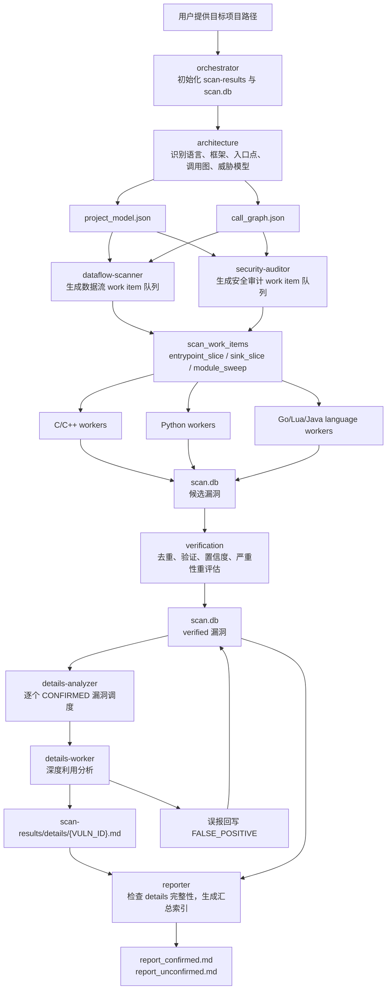
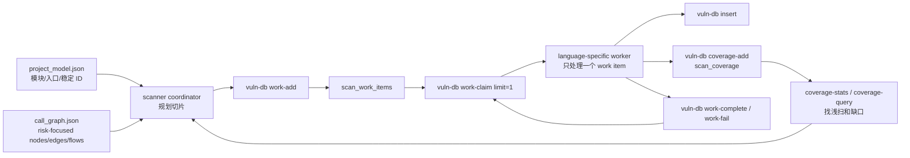
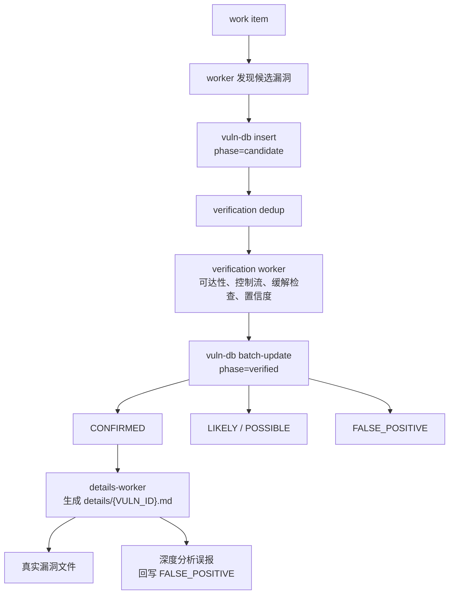

# OpenCode 多语言漏洞挖掘 Harness 使用手册

这是一个基于 OpenCode 的多 Agent 漏洞挖掘 harness。它把一次源码审计拆成架构识别、切片扫描、漏洞验证、深度利用分析和报告索引几个阶段，并把中间结果统一写入 SQLite，便于断点续扫、去重和审计复核。

当前支持的语言：

- C/C++
- Python
- Go
- Lua
- Java

推荐用户把本目录中的 `.opencode/` 放到目标项目根目录，然后通过 `@orchestrator` 发起扫描。最终主交付物是一个报告文件夹：`scan-results/details/`，一个真实漏洞一个 Markdown 文件。

## 一句话理解

本项目不是单个扫描脚本，而是一套“审计流水线”：

1. 先理解项目结构、语言组成、入口点和调用图。
2. 再按语言、入口点、危险 sink、模块兜底生成小颗粒度 work item。
3. Scanner worker 只处理一个小切片，把候选漏洞写入 `scan.db`。
4. Verification worker 对候选漏洞去重、验证、降误报。
5. Details worker 对每个确认漏洞写独立深度报告。
6. Reporter 生成汇总索引，方便审计人员从总览跳到单漏洞报告。

## 总流程图



## 阶段说明

| 阶段 | Agent | 主要输入 | 主要输出 | 目的 |
| ---- | ----- | -------- | -------- | ---- |
| 0 | orchestrator | 用户给出的目标项目绝对路径 | `scan-results/`、`scan.db`、`scan_log.json` | 初始化扫描并协调后续阶段 |
| 1 | architecture | 目标源码、可选 `threat.md` | `project_model.json`、`call_graph.json`、`threat_analysis_report.md` | 建立项目模型和攻击面上下文 |
| 2A | dataflow-scanner | 项目模型、调用图、语言规则包 | `scan_work_items`、候选数据流漏洞 | 按入口点、sink 和模块兜底拆分扫描任务 |
| 2B | security-auditor | 项目模型、调用图、语言规则包 | `scan_work_items`、候选安全配置/认证/协议漏洞 | 扫凭证、授权、协议、配置等安全问题 |
| 3 | verification | `scan.db` 候选漏洞 | `scan.db` verified 漏洞 | 去重、验证可达性、计算置信度、降低误报 |
| 4 | details-analyzer/details-worker | CONFIRMED 漏洞、源码、调用图 | `details/{VULN_ID}.md` | 对每个真实漏洞做深度利用分析 |
| 5 | reporter | `scan.db`、`details/`、项目模型 | `report_confirmed.md`、`report_unconfirmed.md` | 生成汇总索引和审计入口 |

## 两个 Scanner Coordinator 的边界

本项目保留 `dataflow-scanner` 和 `security-auditor` 两个扫描协调者，但它们的职责必须分开，避免同一问题被重复报告，也避免 worker 在大项目中跑偏。

| Coordinator | 负责 | 不负责 | `analysis_kind` |
| ----------- | ---- | ------ | --------------- |
| `dataflow-scanner` | 可证明 `source -> sanitizer -> sink` 的数据流漏洞：注入、路径遍历、SSRF、反序列化、模板注入、XXE、C/C++ 长度进入内存操作等 | 认证策略、授权策略、硬编码密钥、TLS/加密配置、会话配置、框架安全开关 | 固定为 `dataflow` |
| `security-auditor` | 语义/策略/配置类安全问题：认证、授权、会话、JWT/OAuth、密钥、TLS/加密、随机数、时序比较、框架误用、运行时安全配置 | 普通 SQL/命令/模板/路径/XXE/SSRF/反序列化 source→sink 漏洞，除非根因是安全策略或配置语义错误 | `authn`、`authz`、`session`、`secret`、`crypto`、`config`、`framework_misuse` |

## 输入输出总览

### 必需输入

| 输入 | 说明 |
| ---- | ---- |
| 目标项目绝对路径 | 必须由用户在提示词中明确给出。不要默认为当前目录 |
| `.opencode/` 目录 | 本 harness 的 agent、skill、tool、语言规则都在这里 |
| OpenCode 运行环境 | 用于加载 agent、skill 和自定义工具 |

### 可选输入

| 输入 | 路径 | 作用 |
| ---- | ---- | ---- |
| 攻击面约束 | `{PROJECT_ROOT}/threat.md` | 用户或 `@threat-analyst` 预先定义扫描范围，减少误报 |
| 评分规则 | `{SCAN_OUTPUT}/.context/scoring_rules.json` | 自定义 verification 置信度评分 |
| 语言规则 | `.opencode/language/*.json` | 扩展或调整某语言的扩展名、框架、source/sink/sanitizer 规则 |

### 主要输出

| 输出 | 路径 | 说明 |
| ---- | ---- | ---- |
| 主交付目录 | `{SCAN_OUTPUT}/details/` | 一个真实漏洞一个 Markdown 文件 |
| 已确认漏洞汇总 | `{SCAN_OUTPUT}/report_confirmed.md` | CONFIRMED 漏洞索引、统计和修复建议 |
| 待确认漏洞汇总 | `{SCAN_OUTPUT}/report_unconfirmed.md` | LIKELY/POSSIBLE 漏洞索引 |
| 威胁分析报告 | `{SCAN_OUTPUT}/threat_analysis_report.md` | 项目架构、攻击面、信任边界、STRIDE 分析 |
| 项目模型 | `{SCAN_OUTPUT}/.context/project_model.json` | 语言、模块、入口点、框架、信任边界、稳定 ID、证据和扫描范围 |
| 调用图 | `{SCAN_OUTPUT}/.context/call_graph.json` | 风险相关稀疏调用图、数据流路径和未解析动态调用 |
| 漏洞数据库 | `{SCAN_OUTPUT}/.context/scan.db` | 候选漏洞、验证结果、work item 队列、agent 日志 |
| 本次扫描深度配置 | `{SCAN_OUTPUT}/.context/scan_profile.json` | Orchestrator 解析后的实际 profile、轮数和补扫策略 |
| 扫描日志 | `{SCAN_OUTPUT}/.context/scan_log.json` | 各阶段状态、耗时、输出文件 |
| 扫描深度模板 | `.opencode/scan-profiles.json` | `quick` / `standard` / `deep` / `paranoid` 的轮数和补扫策略；缺失时使用内置 `deep` 兜底 |

默认 `SCAN_OUTPUT` 为：

```text
{PROJECT_ROOT}/scan-results
```

## 输出目录结构

```text
scan-results/
├── .context/
│   ├── scan.db
│   ├── project_model.json
│   ├── call_graph.json
│   ├── scan_profile.json
│   ├── scan_log.json
│   └── scoring_rules.json
├── threat_analysis_report.md
├── report_confirmed.md
├── report_unconfirmed.md
└── details/
    ├── VULN-DF-CPP-MEMCPY-IPC-001.md
    ├── VULN-SEC-JAVA-CONFIG-HTTPCLIENT-001.md
    └── ...
```

`details/` 是最终给用户审计的核心目录。每个文件包含漏洞细节、漏洞代码、完整攻击链路、攻击条件、影响、PoC、验证环境和修复建议。Details worker 如果在深度分析时确认误报，会把数据库状态回写为 `FALSE_POSITIVE`，不会生成单漏洞文件。

## 使用方式

### 1. 准备目标项目

把 `.opencode/` 目录复制到目标项目根目录：

```text
your-target-project/
├── .opencode/
│   ├── agents/
│   ├── skills/
│   ├── tools/
│   ├── language/
│   ├── scan-profiles.json
│   └── opencode.jsonc
└── ...
```

目标项目可以是 C/C++、Python、Go、Lua、Java，或这些语言混合的项目。

### 2. 可选：添加攻击面约束

如果你已经知道重点入口，可以在目标项目根目录放一个 `threat.md`：

```markdown
# Threat Scope

重点扫描：
- 对外 HTTP/RPC 接口
- 文件解析入口
- 鉴权、权限判断、token 校验
- 命令执行、反序列化、模板渲染、SQL 查询

忽略：
- 测试目录
- 示例代码
- 第三方 vendored 代码
```

也可以先让 `@threat-analyst` 交互式生成：

```text
@threat-analyst 请分析 D:\path\to\project 的攻击入口，并生成 threat.md
```

### 3. 启动 OpenCode

在目标项目根目录启动：

```bash
cd your-target-project
opencode
```

### 4. 发起完整扫描

推荐明确给出项目绝对路径：

```text
@orchestrator 请扫描项目 D:\path\to\your-target-project，输出一个漏洞一个文件的审计报告
```

Linux/macOS 示例：

```text
@orchestrator 请扫描项目 /home/user/your-target-project，输出一个漏洞一个文件的审计报告
```

Orchestrator 会自动执行完整流程：architecture → dataflow/security 并行扫描 → verification → details → reporter。

### 5. 只运行某个阶段

当你只想调试某个阶段时，可以直接调用对应 agent：

```text
@architecture 分析项目 D:\path\to\project 的语言组成、入口点和调用图
```

```text
@dataflow-scanner 基于 D:\path\to\project\scan-results\.context 的 project_model.json 和 call_graph.json 继续扫描数据流漏洞
```

```text
@security-auditor 基于 D:\path\to\project\scan-results\.context 继续审计认证、授权、凭证和协议安全问题
```

```text
@verification 验证 D:\path\to\project\scan-results\.context\scan.db 中的候选漏洞
```

```text
@details-analyzer 为 D:\path\to\project\scan-results\.context\scan.db 中的 CONFIRMED 漏洞生成逐漏洞深度报告
```

```text
@reporter 检查 details 目录完整性，并生成 confirmed/unconfirmed 汇总索引
```

## 大项目如何避免扫浅

大项目最容易出现的问题是：一个 worker 一次拿到太多文件，模型上下文被挤爆，最后只能做浅层摘要。本 harness 用 `scan_work_items` 队列解决这个问题。



单个 work item 的建议约束：

| 约束 | 建议值 |
| ---- | ------ |
| 文件数量 | 5-10 个文件 |
| 代码量 | 约 2500 行以内 |
| focus | 不超过 3 类 sink 或安全主题 |
| 语言 | 单语言；mixed 模块先拆成单语言切片 |
| 扩展 | 需要更多上下文时返回 `EXPANSION_NEEDED`，由协调者生成新切片 |

这对 GLM-5 这类模型尤其重要：协调者负责拆任务，worker 保持上下文小而深。

## 扫描深度档位

默认使用 `deep`，目的是降低 AI 单次运行不稳定带来的漏扫风险。可以在用户提示中指定 `quick`、`standard`、`deep` 或 `paranoid`。

| profile | 轮数 | 独立 pass | 行为 |
| ------- | ---- | --------- | ---- |
| `quick` | 1 | 1 | 只做一轮广覆盖 |
| `standard` | 2 | 1 | 增加低覆盖补扫 |
| `deep` | 4 | 高风险至少 2 个 pass | 高风险切片会从正向、反向或 negative review 视角复扫 |
| `paranoid` | 5 | 高风险至少 3 个 pass | 增加 disagreement review，对冲突结论做一致性检查 |

每个 worker 都必须返回 `COVERAGE_LEDGER`，由 coordinator 写入 `scan_coverage`。如果发现 `expansion_needed`、`shallow`、`partial`，且尚未达到 `MAX_ROUNDS`，coordinator 会继续生成下一轮 work item。

重复 pass 会写入 `pass_id/pass_kind`。常见 `pass_kind` 包括 `primary`、`sink_to_source`、`negative_review`、`cross_module` 和 `disagreement_review`。它不是简单重复同一 prompt，而是让同一高风险切片从不同分析视角独立复核，候选漏洞取并集，后续由 verification/dedup 合并。

Orchestrator 会先调用 `scan-profile-resolver`，把最终采用的配置写入 `{SCAN_OUTPUT}/.context/scan_profile.json`。后续 scanner 读取这个已解析文件，不再自己寻找原始 `scan-profiles.json`。如果目标项目没有复制 `scan-profiles.json`，会自动使用 harness 自带配置；仍找不到时使用内置 `deep` 兜底，并在 `scan_profile.json.warnings` 中记录原因。

## 多语言分发规则

Architecture agent 会识别模块语言，并把语言写入 `project_model.json`。Scanner coordinator 再按语言字段选择 worker。

`project_model.json` 和 `call_graph.json` 是后续扫描的结构化上下文：

- `project_model.json` 负责项目地图、扫描范围、模块/文件/入口点稳定 ID、证据和置信度。
- `call_graph.json` 负责风险相关稀疏图，只覆盖入口点、高危 sink、跨模块边界和框架调度点。
- Scanner 只能把调用图作为切片和验证线索；最终漏洞结论必须回源代码、LSP 或 grep 验证。

| 语言 | 数据流 worker | 安全审计 worker | 规则来源 |
| ---- | ------------- | --------------- | -------- |
| C/C++ | `dataflow-module-scanner` | `security-module-scanner` | `language/c-cpp.json`、`skills/c-cpp-taint-tracking` |
| Python | `python-dataflow-module-scanner` | `python-security-module-scanner` | `language/python.json`、`skills/python-taint-tracking` |
| Go | `language-module-scanner` | `language-security-module-scanner` | `language/go.json`、`skills/go-taint-tracking` |
| Lua | `language-module-scanner` | `language-security-module-scanner` | `language/lua.json`、`skills/lua-taint-tracking` |
| Java | `language-module-scanner` | `language-security-module-scanner` | `language/java.json`、`skills/java-taint-tracking` |

混合模块会先按文件语言、入口点和调用关系拆成多个 work item，不应把 `mixed` 直接交给 worker 扫整个模块。

## 漏洞数据流转



Scanner 插入候选漏洞时应尽量包含这些字段：

| 字段 | 说明 |
| ---- | ---- |
| `id` | 漏洞唯一 ID |
| `source_agent` | 发现漏洞的 agent |
| `source_module` | 所属模块 |
| `language` | `c_cpp`、`python`、`go`、`lua`、`java` |
| `framework` | 框架或运行时，例如 Spring、Gin、OpenResty |
| `analysis_kind` | 分析类型，例如 `dataflow`、`authn`、`authz`、`crypto`、`config`、`secret`、`framework_misuse` |
| `type` / `cwe` | 漏洞类型和 CWE |
| `severity` | 初始严重性 |
| `file` / `line_start` / `line_end` | 位置 |
| `function_name` | 相关函数或方法 |
| `source_kind` | 污点来源，例如 HTTP 参数、文件输入、环境变量 |
| `sink_kind` | 危险点，例如 SQL、命令执行、反序列化 |
| `sanitizer_checked` | 已检查的过滤、校验、权限检查 |
| `data_flow` | 从 source 到 sink 的路径 |
| `evidence_json` | 结构化证据 |
| `rule_id` | 命中的规则 |
| `analysis_backend` | `lsp`、`grep`、`manual` 等证据来源 |

### 漏洞编号规范

漏洞 ID 是单漏洞报告文件名，也是数据库主键，必须稳定、可读、可排序。

```text
VULN-{CHANNEL}-{LANG}-{KIND}-{MODULE}-{NNN}
```

| 段 | 示例 | 说明 |
| -- | ---- | ---- |
| `CHANNEL` | `DF` / `SEC` | 数据流通道或安全审计通道 |
| `LANG` | `CPP` / `PY` / `GO` / `LUA` / `JAVA` / `MIX` | 漏洞所在语言 |
| `KIND` | `SQLI` / `MEMCPY` / `AUTHZ` / `SECRET` / `CONFIG` | 漏洞类别 |
| `MODULE` | `IPC` / `AUTH` / `HTTPCLIENT` | 稳定模块名缩写 |
| `NNN` | `001` | 同前缀下递增编号 |

示例：

- `VULN-DF-CPP-MEMCPY-IPC-001`
- `VULN-DF-PY-SQLI-SEARCH-001`
- `VULN-SEC-JAVA-CONFIG-HTTPCLIENT-001`

最终单漏洞报告标题必须能概括漏洞情况，格式为：

```markdown
# VULN-DF-PY-SQLI-SEARCH-001: 订单查询参数拼接进入 SQL 导致注入
```

标题应包含受影响组件、漏洞类型、触发条件或影响，避免“存在安全漏洞”这类泛化描述。

## 断点续扫

扫描过程中断后，再次调用 `@orchestrator` 即可恢复。恢复时会检查：

- `scan_log.json` 中各 agent 状态。
- `scan_work_items` 中 pending/running/failed/success 数量。
- `scan.db` 中 candidate/verified 数据。
- `details/` 中已生成的单漏洞报告。

Scanner 恢复时会先执行 `work-requeue`，把上次中断的 running/failed work item 放回 pending，然后继续 `work-claim`。

Details 恢复时会跳过已经存在的 `details/{VULN_ID}.md`，只分析缺失的剩余 CONFIRMED 漏洞。

## 常用数据库工具

自定义工具 `vuln-db` 是所有 agent 共享的状态中心。

| 命令 | 用途 |
| ---- | ---- |
| `init` | 初始化 `scan.db` |
| `insert` | 批量写入候选漏洞 |
| `query` | 查询漏洞 |
| `update` | 更新单个漏洞 |
| `batch-update` | 批量更新验证结果 |
| `dedup` | 候选漏洞去重 |
| `stats` | 按状态、严重性、模块、语言统计 |
| `work-add` | 写入 work item 队列 |
| `work-query` | 查询 work item |
| `work-claim` | 领取 pending work item |
| `work-complete` | 标记 work item 成功 |
| `work-fail` | 标记 work item 失败 |
| `work-requeue` | 恢复中断任务 |
| `work-stats` | 查看 work item 状态统计 |

示例：

```text
vuln-db command=stats db_path={SCAN_OUTPUT}/.context/scan.db phase=verified
```

```text
vuln-db command=work-stats db_path={SCAN_OUTPUT}/.context/scan.db agent_name=dataflow-scanner
```

## 如何阅读最终报告

建议审计人员按这个顺序看：

1. 打开 `report_confirmed.md` 看严重性分布、Top 漏洞和单漏洞报告索引。
2. 进入 `details/`，按 Critical → High → Medium → Low 的顺序逐个打开。
3. 每个 `details/{VULN_ID}.md` 中重点看：
   - 完整攻击链路是否真实可达。
   - 漏洞代码和行号是否准确。
   - 攻击条件是否符合目标部署环境。
   - PoC 是否只用于授权验证。
   - 修复建议是否能落到代码或配置。
4. 对 `report_unconfirmed.md` 中 LIKELY/POSSIBLE 的问题做人工抽样或二次验证。

## 适用场景

| 语言 | 典型项目 |
| ---- | -------- |
| C/C++ | 网络服务、协议解析、数据库、系统组件、嵌入式固件、命令行工具 |
| Python | Flask、Django、FastAPI、CLI、任务队列、数据处理、微服务 |
| Go | net/http、Gin、Echo、Fiber、gRPC、CLI、后台 worker |
| Lua | OpenResty、Kong 插件、Nginx Lua、游戏/嵌入式脚本 |
| Java | Spring、Servlet、JAX-RS、Netty、反序列化、JCA/TLS、企业服务 |

不建议直接扫描第三方依赖目录、生成代码目录、测试目录和示例目录。可以通过 `threat.md` 明确排除。

## 项目内部结构

```text
.opencode/
├── agents/
│   ├── orchestrator.md
│   ├── architecture.md
│   ├── dataflow-scanner.md
│   ├── security-auditor.md
│   ├── verification.md
│   ├── details-analyzer.md
│   ├── reporter.md
│   └── *-worker.md
├── language/
│   ├── c-cpp.json
│   ├── python.json
│   ├── go.json
│   ├── lua.json
│   └── java.json
├── skills/
│   ├── agent-communication/
│   ├── vulnerability-db/
│   ├── cross-file-analysis/
│   ├── pre-validation-rules/
│   └── *-taint-tracking/
├── tools/
│   ├── vuln-db.ts
│   ├── report-generator.ts
│   ├── scan-profile-resolver.ts
│   └── validate-json.ts
├── scan-profiles.json
└── opencode.jsonc
```

## 扩展或调整规则

### 调整某语言规则

优先改 `.opencode/language/{language}.json`：

- 文件扩展名和排除目录。
- 常见框架和入口点模式。
- source/sink/sanitizer 规则。
- 高风险 API 和误报过滤提示。

### 增加新的漏洞类型

通常需要同时改三处：

1. 语言规则包：补充 source/sink/sanitizer。
2. 对应 taint-tracking skill：补充分析方法和示例。
3. worker prompt：要求输出对应 `type`、`cwe`、`rule_id` 和证据字段。

### 增加新语言

建议按这个顺序：

1. 新增 `.opencode/language/{new_language}.json`。
2. 新增 `skills/{new_language}-taint-tracking/SKILL.md`。
3. 在 architecture 中加入语言检测和模块语言标注。
4. 在 dataflow/security coordinator 中加入分发规则。
5. 复用 `language-module-scanner` / `language-security-module-scanner`，除非该语言需要专用 worker。

## 常见问题

### 为什么要求用户提供绝对路径？

为了避免 agent 在错误目录里扫描。Orchestrator 被要求在缺少目标项目绝对路径时停止并询问，不会默认使用当前目录。

### 为什么不是一个 agent 直接扫完整项目？

大项目会让模型上下文爆炸，扫描容易变浅。work item 队列让每次分析只聚焦小切片，同时用数据库保存状态，能恢复、统计和复核。

### 为什么 details 是主交付？

审计时真正需要的是逐漏洞证据链：位置、代码、可达性、攻击条件、PoC、修复方式。汇总报告适合看全局，但不适合替代单漏洞审计。

### 为什么有 CONFIRMED 但没有 details 文件？

正常流程不应出现。如果 details-worker 深度分析后认为是误报，details-analyzer 会把它回写为 `FALSE_POSITIVE`。如果仍是 CONFIRMED 却没有文件，Reporter 会停止并报告缺失列表。

### 可以只看 report_confirmed.md 吗？

可以快速了解整体风险，但正式审计应逐个查看 `details/{VULN_ID}.md`。汇总报告只是索引，单漏洞文件才是证据主体。
